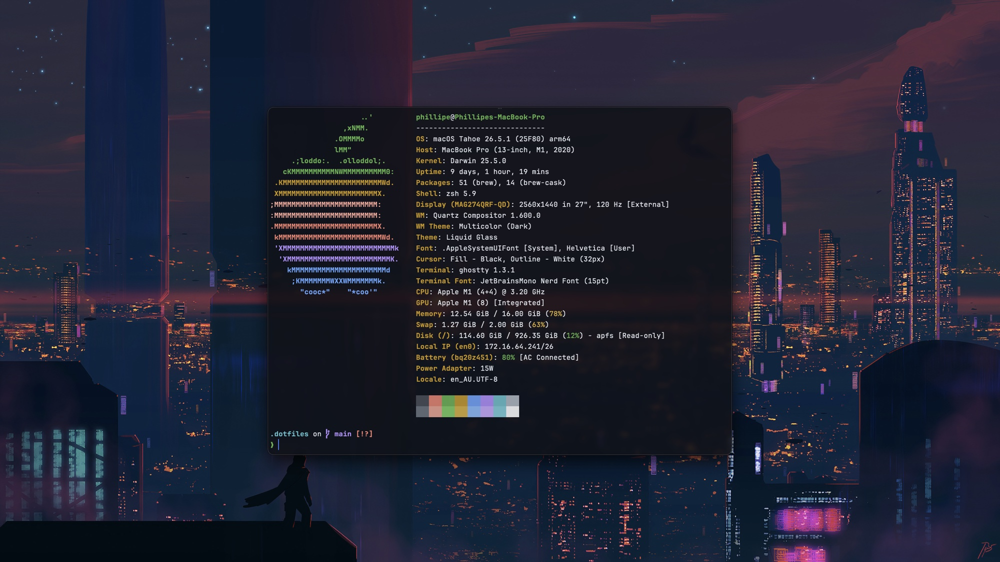

<div align="center">

# `~/.dotfiles`

[](#support)
[](#support)
[](https://www.zsh.org/)
[](https://neovim.io/)
[](https://www.gnu.org/software/stow/)



<sub>Ghostty · Zsh · Starship · GitHub Dark Default</sub>

</div>

## Lean, Minimal & Feature Rich 

- **⚡ A shell that keeps up** — Zsh, Zinit, Starship, fzf-tab, autosuggestions, and syntax highlighting.
- **🧠 An editor with teeth** — Custom Neovim powered by lazy.nvim, LSP, Treesitter, Blink, Snacks, and Copilot.
- **🧭 Navigation without friction** — Jump with zoxide, search with fzf and ripgrep, and browse files with Yazi.
- **♻️ Rebuildable by design** — Homebrew installs the toolchain while GNU Stow puts every config in its place.

## Stack

| Layer | Tools |
| --- | --- |
| Terminal | [Ghostty](https://ghostty.org/) + JetBrains Mono Nerd Font + GitHub Dark Default |
| Shell | Zsh + [Zinit](https://github.com/zdharma-continuum/zinit) + [Starship](https://starship.rs/) |
| Editor | [Neovim](https://neovim.io/) + [lazy.nvim](https://github.com/folke/lazy.nvim) |
| Navigation | fzf · zoxide · fd · ripgrep · Yazi |
| Daily CLI | bat · eza · lazygit · git-delta · Atuin · btop |
| Runtimes | fnm · uv |
| Packages | Homebrew on macOS · Linuxbrew on Ubuntu |

The full package manifest lives in [`Brewfile`](./Brewfile).

## Quick start

> [!IMPORTANT]
> This is a personal setup. Read the bootstrap script and fork the repo before running it as your own.

### SSH

```bash
git clone git@github.com:sirbastio/.dotfiles.git ~/.dotfiles
cd ~/.dotfiles
./scripts/bootstrap.sh
```

<details>
<summary><strong>Using HTTPS instead?</strong></summary>

```bash
git clone https://github.com/sirbastio/.dotfiles.git ~/.dotfiles
cd ~/.dotfiles
./scripts/bootstrap.sh
```

</details>

For an unattended install:

```bash
./scripts/bootstrap.sh --yes
```

## What the bootstrap does

```text
detect platform
      │
      ├── create XDG directories
      ├── install system prerequisites on Ubuntu
      ├── install Homebrew / Linuxbrew
      ├── install everything in the Brewfile
      ├── install Zinit
      ├── link configs with GNU Stow
      └── configure Atuin and check the login shell
```

| Flag | Effect |
| --- | --- |
| `--yes` | Accept bootstrap prompts for an unattended setup |
| `--skip-brew` | Skip Homebrew installation and `brew bundle` |
| `--skip-apt` | Skip Ubuntu packages installed through `apt` |
| `--skip-zinit` | Skip the Zinit plugin manager |
| `--skip-stow` | Skip linking dotfiles into `$HOME` |
| `--help` | Show all available options |

## Repository map

```text
.
├── .config/
│   ├── ghostty/       # terminal appearance and keybinds
│   ├── git/           # Git defaults
│   ├── nvim/          # custom Neovim distribution
│   ├── yazi/          # terminal file manager theme
│   ├── zsh/           # shell, plugins, aliases, and history
│   └── starship.toml  # prompt configuration
├── scripts/
│   └── bootstrap.sh   # fresh-machine installer
├── .zshenv            # XDG paths and environment
└── Brewfile           # CLI tool manifest
```

## Support

| Environment | Status | Package prefix |
| --- | :---: | --- |
| Apple silicon macOS | ✅ | `/opt/homebrew` |
| Ubuntu | ✅ | `/home/linuxbrew/.linuxbrew` |
| Ubuntu on WSL | ✅ | `/home/linuxbrew/.linuxbrew` |
| Intel macOS / other Linux distributions | ❌ | The script exits before making changes |

On Ubuntu, `apt` provides OS-level prerequisites such as Zsh and Linuxbrew build tools. Everything else is installed through the Brewfile.

## Good to know

- GNU Stow will not overwrite existing unmanaged dotfiles. Move or merge any conflicts before rerunning the bootstrap.
- Zinit downloads the configured Zsh plugins when a new shell starts for the first time.
- Neovim installs its plugins on first launch.
- The bootstrap does not change your login shell automatically. If needed, it prints the exact `chsh` command for you to review and run.
