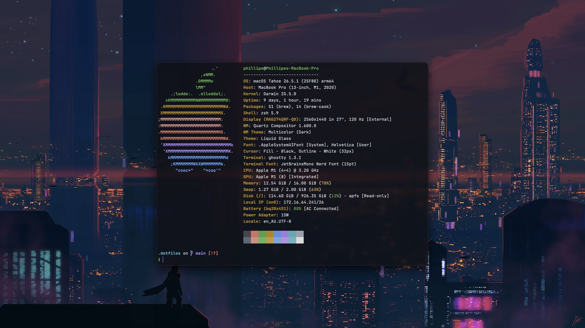

<div align="center">

# `~/.dotfiles`

[](#support)
[](https://www.zsh.org/)
[](https://neovim.io/)
[](https://www.gnu.org/software/stow/)



</div>

## Features

> **Lean, extensible, portable, and feature-rich.**
>
> Keep the core experience of the terminal with improvements around the edge. No needing to rewrite muscle memory or learn new keymaps.

| Feature | Description |
| --- | --- |
| Theme | Github Dark Default. This config is optimised heavily for this theme. |
| Terminal | Ghostty. Any modern terminal should work. |
| Editor | Both a custom neovim distribution ([found here](./.config/nvim/)) and a vim config - because most the time vim is all you need. |
| Multiplexer | A minimal tmux setup with the option of herdr for AI integration (note: herdr still has some rough edges as of writing). |
| CLI&nbsp;Tooling | Modern cli tooling without going overboard. |
| SSH&nbsp;Editing | The `nssh <ssh-host> [remote-path]` helper opens a remote path in Neovim over SSH using oil. It is not a replacement for an on-host neovim config, but still works. 

## Quick Start

> [!IMPORTANT]
> This is a personal setup. If for you stumble across this and wish to use it please read the bootstrap script and fork the repo. If you wish to not use brew use the `--skip-brew` flag. You can find the package manifest in [`Brewfile`](./Brewfile)

### SSH

```bash
git clone git@github.com:sirbastio/.dotfiles.git ~/.dotfiles
cd ~/.dotfiles
./scripts/bootstrap.sh --yes # accept the bootstrap confirmation
```

<details>
<summary><strong>HTTPS instead?</strong></summary>

```bash
git clone https://github.com/sirbastio/.dotfiles.git ~/.dotfiles
cd ~/.dotfiles
./scripts/bootstrap.sh --yes
```

</details>

### Bootstrap Script


```text
start bootstrap
      │
      ├── report the host from `uname`
      ├── create XDG directories
      ├── run the official Homebrew installer
      ├── install everything in the Brewfile
      ├── install Zinit
      ├── link configs with GNU Stow
      ├── install TPM and configured tmux plugins
      └── configure Atuin and check the login shell
```

| Flag | Effect |
| --- | --- |
| `--yes` | Accept the bootstrap confirmation; Homebrew may still prompt |
| `--skip-brew` | Skip Homebrew installation and `brew bundle` |
| `--skip-zinit` | Skip the Zinit plugin manager |
| `--skip-tpm` | Skip Tmux Plugin Manager and tmux plugins |
| `--skip-stow` | Skip linking dotfiles into `$HOME` |
| `--help` | Show all available options |

The bootstrap configures Atuin so Ctrl-R searches all history and Up Arrow searches
history from the current directory. Rerunning it reapplies these settings while
preserving other Atuin preferences.

## Repository Map

```text
.
├── .config/    # application and tool configurations
├── scripts/
├── .zshenv     # shared Zsh environment and XDG paths
└── Brewfile    # Homebrew package manifest
```

## Support

The bootstrap does not detect Linux distributions or any  system package manager. It requires Bash and `curl`, then delegates host detection and prerequisite checks to the [official Homebrew installer](https://docs.brew.sh/Installation).

If Homebrew cannot install, read its error, install the reported system prerequisites manually, and rerun the bootstrap. Once Homebrew is available, Zsh and the rest of the user-facing toolchain are installed through the Brewfile.

## Good to know

- GNU Stow will not overwrite existing unmanaged dotfiles. Move or merge any conflicts before rerunning the bootstrap.
- Zinit downloads the configured Zsh plugins when a new shell starts for the first time.
- TPM installs the plugins declared in `tmux.conf`; inside tmux, use `Ctrl-a I` to install newly added plugins.
- Neovim installs its plugins on first launch.
- The bootstrap does not change your login shell automatically. If needed, it prints the exact `chsh` command for you to review and run.
